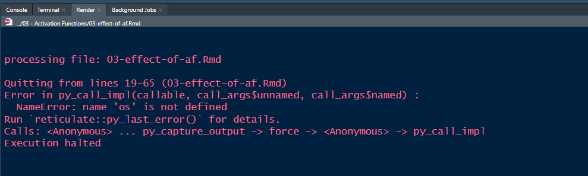
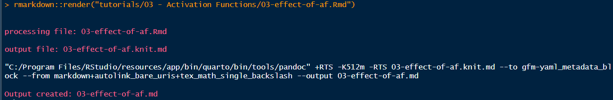
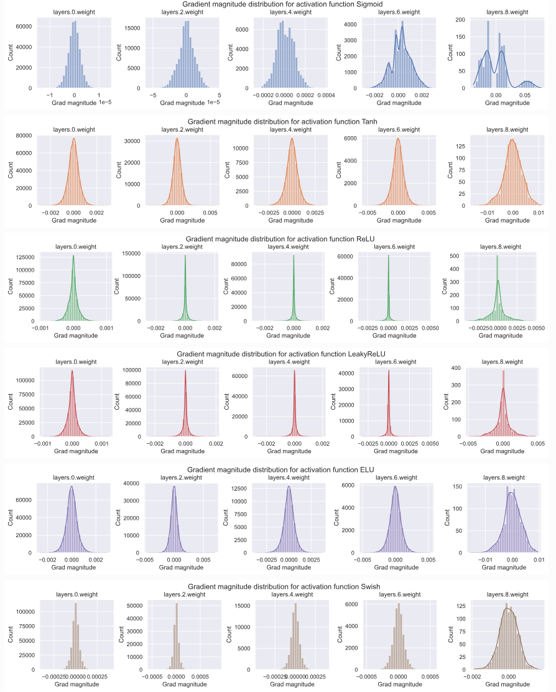
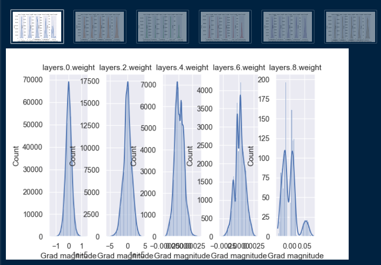
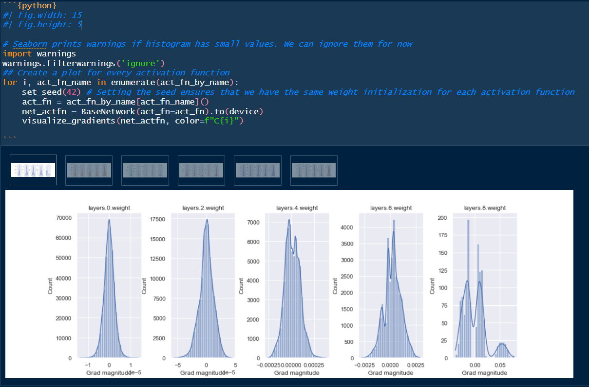
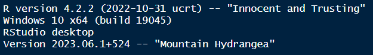

# R-rabbit holes

Using the RStudio IDE to run Python code for this project has me
scurrying down some rabbit holes anytime something doesn’t work or
“works” in an unexpected way. So this notebook will document references
and thingamabobs that helped me to escape them for a bit.

# Knitting to Github Markdown (gfm)

I ran into another weird issue in Tutorial 3 where attempting to `Knit`
the document using the usual gui in RStudio no longer worked. It would
simply quit with an error message about being unable to find the first
`Python` package I had imported in the first `Python` chunk.

This was pretty annoying but fortunately there is a workaround for this:
render using `rmarkdown::render` in the R console instead.

Why did knitting become an issue in Tutorial 3? Maybe a bug was
introduced when I changed the `variant` of the `md_document` in the YAML
header to `gfm`, which the Console had shouted at me to do since
`markdown_github` is
[deprecated](https://github.com/r-lib/pkgdown/pull/1473). I tried
changing this back to `markdown_github` and using the knit gui, but that
had the same outcome where it would quit. Anyway, just use the console
if you run into this weird bug.

Possibly related open issue
[here](https://github.com/rstudio/reticulate/issues/863).

# Rendering figures in RStudio

In Tutorial 3 we started to render some figures that contained multiple
graphs, e.g.

These often did not render well in an R notebook chunk by default.
Here’s that same set of graphs below, for instance.

I learned in a `{reticulate}` [issue
thread](https://github.com/rstudio/reticulate/issues/1140#issuecomment-1625607199)
that you can modify the figure size in a `Python` chunk by using
`fig.width` and `fig.height` inline, as shown below. I thought that was
kinda neat.

It was possible for me to then
move on with ~~my life~~ the tutorials after fiddling with these options
to get a decent-looking-enough figure rendered in the R notebook.
Huzzah!

That was until I knitted the notebook and discovered that the fiddling
did not carry over. 😖 This issue is well-documented in this [closed and
triaged
issue](https://github.com/rstudio/rstudio/issues/4521#issuecomment-1414371481).
There seems to be ongoing work to fix numerous RStudio rendering issues,
[see here](https://github.com/rstudio/rstudio/issues/12740).

So perhaps this will be fixed in the future releases of RStudio? Maybe
you won’t (or didn’t) encounter it yourself because you’re using some
(magical) combination of an RStudio build + OS + knitr/R version. Or
you’re just magical.

Here’s my combo for reference.

*This is an image because knitr can't render if you use
RStudio.Version()*
