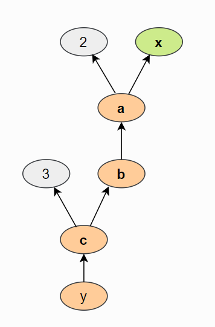

Starting with the basics in this notebook based on UvA’s [Tutorial
2](https://uvadlc-notebooks.readthedocs.io/en/latest/tutorial_notebooks/tutorial2/Introduction_to_PyTorch.html)

Here’s my python configuration for this project.

``` r
py_config()
```

    ## python:         C:/anaconda3/python.exe
    ## libpython:      C:/anaconda3/python311.dll
    ## pythonhome:     C:/anaconda3
    ## version:        3.11.3 | packaged by Anaconda, Inc. | (main, Apr 19 2023, 23:46:34) [MSC v.1916 64 bit (AMD64)]
    ## Architecture:   64bit
    ## numpy:          C:/anaconda3/Lib/site-packages/numpy
    ## numpy_version:  1.24.3
    ## 
    ## NOTE: Python version was forced by RETICULATE_PYTHON

I wonder which of the standard Python libraries I have already? Let’s
check.

``` python
import os
import math
import numpy as np
import time

## Imports for plotting
import matplotlib.pyplot as plt
from matplotlib.colors import to_rgba
import seaborn as sns
sns.set()

## Progress bar
from tqdm.notebook import tqdm
```

All imported with no issues. Very nice. Thanks, conda. \<3

*8-6-2023 bug encountered with this notebook*  
Every time I tried to run the above chunk to import some python
packages, I noticed that `reticulate::repl_python()` would run followed
immediately by `exit` and then whatever I had in the setup chunk would
be executed. My R Session would then be frozen. Sometimes my session
would crash. In other words, I could not run any python chunks. I
removed and re-installed {reticulate} and {Rcpp} but this didn’t change
anything. I unchecked the option to run the setup chunk automatically in
my Global Options, and voila - I could then run python chunks. No idea
what the issue or bug is related to having the setup chunk prioritized
within a python chunk run. Here’s my current session info for reference.

``` r
sessionInfo()
```

    ## R version 4.2.2 (2022-10-31 ucrt)
    ## Platform: x86_64-w64-mingw32/x64 (64-bit)
    ## Running under: Windows 10 x64 (build 19045)
    ## 
    ## Matrix products: default
    ## 
    ## locale:
    ## [1] LC_COLLATE=English_United States.utf8 
    ## [2] LC_CTYPE=English_United States.utf8   
    ## [3] LC_MONETARY=English_United States.utf8
    ## [4] LC_NUMERIC=C                          
    ## [5] LC_TIME=English_United States.utf8    
    ## 
    ## attached base packages:
    ## [1] stats     graphics  grDevices utils     datasets  methods   base     
    ## 
    ## other attached packages:
    ## [1] dplyr_1.1.2     reticulate_1.30 here_1.0.1     
    ## 
    ## loaded via a namespace (and not attached):
    ##  [1] Rcpp_1.0.11      rstudioapi_0.14  knitr_1.42       magrittr_2.0.3  
    ##  [5] tidyselect_1.2.0 lattice_0.20-45  R6_2.5.1         rlang_1.1.1     
    ##  [9] fastmap_1.1.1    fansi_1.0.4      tools_4.2.2      grid_4.2.2      
    ## [13] xfun_0.39        png_0.1-8        utf8_1.2.3       cli_3.6.1       
    ## [17] withr_2.5.0      htmltools_0.5.5  yaml_2.3.7       rprojroot_2.0.3 
    ## [21] digest_0.6.31    tibble_3.2.1     lifecycle_1.0.3  Matrix_1.5-4.1  
    ## [25] vctrs_0.6.2      glue_1.6.2       evaluate_0.21    rmarkdown_2.21  
    ## [29] compiler_4.2.2   pillar_1.9.0     generics_0.1.3   jsonlite_1.8.4  
    ## [33] pkgconfig_2.0.3

# The Basics of PyTorch

Now we’ll import torch.

``` python
import torch
print("Using torch", torch.__version__, "with CUDA", torch.cuda_version)
```

    ## Using torch 2.0.1 with CUDA 11.7

## Tensors

OK, now we’ll move on to some `tensor` stuff. In ML/DL context, tensors
are basically multidimensional arrays. If you want to go down a rabbit
hole about why they’re called tensors when tensors are something very
specific in mathematics, then you can [start
here](https://stats.stackexchange.com/a/198395). 🐇

``` python
x = torch.Tensor(2, 3, 4)
print(x)
```

    ## tensor([[[0., 0., 0., 0.],
    ##          [0., 0., 0., 0.],
    ##          [0., 0., 0., 0.]],
    ## 
    ##         [[0., 0., 0., 0.],
    ##          [0., 0., 0., 0.],
    ##          [0., 0., 0., 0.]]])

Oooh, neat. Apparently memory is allocated when we use `torch.Tensor`
but the values it initializes with are those that have already been in
memory. I like that (I don’t know why, but I do).

Other ways to specify values for tensors:

-   `torch.zeros` - values filled with zeros  
-   `torch.ones` - values filled with ones  
-   `torch.rand` - values filled with samples drawn from a uniform
    distribution between 0 and 1  
-   `torch.randn` - values filled with samples drawn from a normal
    distribution with mean 0 and variance 1  
-   `torch.arange` - values are filled with N, N+1, N+2, …, M. The step
    can be non-integer, e.g.

``` python
torch.arange(0, 1, 0.05)
```

    ## tensor([0.0000, 0.0500, 0.1000, 0.1500, 0.2000, 0.2500, 0.3000, 0.3500, 0.4000,
    ##         0.4500, 0.5000, 0.5500, 0.6000, 0.6500, 0.7000, 0.7500, 0.8000, 0.8500,
    ##         0.9000, 0.9500])

We can use nested lists to specify the elements of a tensor directly.

``` python
x = torch.Tensor([[1, 2], [3, 4]])
print(x)
```

    ## tensor([[1., 2.],
    ##         [3., 4.]])

The methods to obtain the shape of a tensor are `size` and `shape`.

``` python
print("Shape:", x.shape)
```

    ## Shape: torch.Size([2, 2])

``` python
print("Size:", x.size())
```

    ## Size: torch.Size([2, 2])

## Tensor to Numpy and vice versa

We use the `from_numpy` to go from a numpy array to a tensor.

``` python
np_arr = np.array([[1, 2], [3, 4]])
tensor = torch.from_numpy(np_arr)

print(tensor)
```

    ## tensor([[1, 2],
    ##         [3, 4]], dtype=torch.int32)

And `.numpy()` to go from a PyTorch tensor to a numpy array.

``` python
tensor = torch.arange(4)
np_arr = tensor.numpy()

print("I'm a", tensor)
```

    ## I'm a tensor([0, 1, 2, 3])

``` python
print("And here I am as an Numpy array: ", np_arr)
```

    ## And here I am as an Numpy array:  [0 1 2 3]

An important note from the tutorial:

> The conversion of tensors to numpy require the tensor to be on the
> CPU, and not the GPU (more on GPU support in a later section). In case
> you have a tensor on GPU, you need to call .cpu() on the tensor
> beforehand. Hence, you get a line like np_arr = tensor.cpu().numpy().

## Operations

Check the [PyTorch docs](https://pytorch.org/docs/stable/tensors.html#)
for the full set of tensor operations available.

We can either create new tensors using operations or use methods to
perform in-place operations that will modify the tensor. These usually
have an underscore postfix.

``` python
x1 = torch.rand(2, 3)
x2 = torch.rand(2, 3)
print("x1 before:\n", x1)
```

    ## x1 before:
    ##  tensor([[0.6653, 0.8861, 0.8338],
    ##         [0.1946, 0.1143, 0.8771]])

``` python
# Now add to x1
x1.add_(x2)
```

    ## tensor([[1.4146, 1.2458, 1.3079],
    ##         [0.6843, 0.2819, 1.6789]])

``` python
print("x1 after:\n", x1)
```

    ## x1 after:
    ##  tensor([[1.4146, 1.2458, 1.3079],
    ##         [0.6843, 0.2819, 1.6789]])

To re-shape tensors we can use `view` and `permute` operations.

View will add on a row and column shape.

``` python
x = torch.arange(6)
print(x, "\nshapes into")
```

    ## tensor([0, 1, 2, 3, 4, 5]) 
    ## shapes into

``` python
x.view(2, 3)
```

    ## tensor([[0, 1, 2],
    ##         [3, 4, 5]])

Permute swaps the dimensions specified.

``` python
x = x.view(2, 3)
x.permute(0, 1)
```

    ## tensor([[0, 1, 2],
    ##         [3, 4, 5]])

You have to make sure you permute using the same number of dimensions as
the tensor.

Other operations covered in the tutorial are for matrix multiplication.

-   `torch.matmul` - performs matrix product based on the dimensions of
    the tensors. If both are 2-dim then it will be a standard matrix
    product. Higher dimensional inputs will use
    [broadcasting](https://pytorch.org/docs/stable/notes/broadcasting.html#broadcasting-semantics).
    Can also be written as `a @ b`, which is similar to numpy.

-   `torch.mm` - matrix product over two matrices but doesn’t support
    broadcasting.

-   `torch.bmm` - Performs the matrix product with a support batch
    dimension. If the first tensor is of shape (b, n, m), and the second
    tensor (b, m, p), the output is of shape (b, n, p). Basically it
    uses the first dimension as an index and multiplies the matrices of
    dimension (n,m) from the first argument by the matrices of dimension
    (n,p) from the second argument at each index.

-   `torch.einsum` - Performs matrix multiplications and more (i.e. sums
    of products) using the Einstein summation convention.

Shneat. Some examples to demonstrate the different ways of multiplying
stuff.

``` python
x = torch.arange(6)

x = x.view(2, 3)
print(x)
```

    ## tensor([[0, 1, 2],
    ##         [3, 4, 5]])

Stacking operations

``` python
w = torch.arange(12).view(3, 4)
print(w)
```

    ## tensor([[ 0,  1,  2,  3],
    ##         [ 4,  5,  6,  7],
    ##         [ 8,  9, 10, 11]])

``` python
x.matmul(w)
```

    ## tensor([[20, 23, 26, 29],
    ##         [56, 68, 80, 92]])

``` python
x.mm(w)
```

    ## tensor([[20, 23, 26, 29],
    ##         [56, 68, 80, 92]])

How about a broadcasting example.

``` python
x = torch.arange(12).view(2, 3, 2)
w = torch.arange(4).view(1, 2, 2)

z = x.matmul(w)
z.size()
```

    ## torch.Size([2, 3, 2])

``` python
print(z)
```

    ## tensor([[[ 2,  3],
    ##          [ 6, 11],
    ##          [10, 19]],
    ## 
    ##         [[14, 27],
    ##          [18, 35],
    ##          [22, 43]]])

``` python
x = torch.arange(8).view(2, 2, 2)
w = torch.arange(12).view(2, 2, 3)

print("x matmul w:\n", x.matmul(w))
```

    ## x matmul w:
    ##  tensor([[[  3,   4,   5],
    ##          [  9,  14,  19]],
    ## 
    ##         [[ 69,  78,  87],
    ##          [ 99, 112, 125]]])

``` python
print("x bmm w:\n", x.bmm(w))
```

    ## x bmm w:
    ##  tensor([[[  3,   4,   5],
    ##          [  9,  14,  19]],
    ## 
    ##         [[ 69,  78,  87],
    ##          [ 99, 112, 125]]])

# Indexing

We can index on columns or rows of a tensor by using \\ similar to as
indexing a `data.frame` in R.

``` python
x = torch.arange(12).view(3, 4)
print("X", x)
```

    ## X tensor([[ 0,  1,  2,  3],
    ##         [ 4,  5,  6,  7],
    ##         [ 8,  9, 10, 11]])

Speaking of R, what kind of class does R see a PyTorch tensor as?

``` r
class(py$x)
```

    ## [1] "torch.Tensor"          "torch._C._TensorBase"  "python.builtin.object"

Cool. Within the R chunk we can index for the rows of the tensor, but
not any of the columns (any indexing with a comma results in an error
for the object).

I’ll construct a matrix in R with the same shape and values as the `x`
tensor in python.

``` r
x_as_matrix <- 
  matrix(0:11, nrow = 4, ncol = 3) %>% 
  t()

x_as_matrix
```

    ##      [,1] [,2] [,3] [,4]
    ## [1,]    0    1    2    3
    ## [2,]    4    5    6    7
    ## [3,]    8    9   10   11

Note that indexing in python starts at zero for the first column or row.
If you use a `:n` to list multiple indices it only returns up to the
`n-1` index.

``` python
x[0, 0:2] # first row, first two columns
```

    ## tensor([0, 1])

``` python
x[0:2, :] # first two rows, all columns
```

    ## tensor([[0, 1, 2, 3],
    ##         [4, 5, 6, 7]])

To obtain the equivalent parts by indexing the `x` matrix in R we would
do.

``` r
x_as_matrix[1, 1:2]
```

    ## [1] 0 1

``` r
x_as_matrix[1:2, ]
```

    ##      [,1] [,2] [,3] [,4]
    ## [1,]    0    1    2    3
    ## [2,]    4    5    6    7

# Dynamic Computation Graph and Backpropagation

Getting gradients and derivatives of functions we define is where its at
in PyTorch.

Weight matrices transform an input `x` tensor usually via multiplication
and bias vectors usually via addition. A `computational graph` is
generated as we stack on transformations to the input. PyTorch will
track the manipulations along the way in a `dynamic computation graph`.
I wonder if there must be a way to call/view that?

We’ll look at an example of how this graph is created for the following
function

$$
y =  \frac{1}{x}\Sigma\_{i}\[(x_i + 2)^2 + 3\]
$$

By default tensors created do not require gradients, so this must be
specified if needed/desired for the tensor. The input tensor can be
thought of as the parameters.

``` python
x = torch.arange(
  3, 
  dtype = torch.float32, 
  requires_grad = True
)

print(x.requires_grad)
```

    ## True

To optimize *y* we’ll use its gradients. First we’ll build y stepwise.

``` python
a = x + 2
b = a**2
c = b + 3 
y = c.mean()
print("Y", y)
```

    ## Y tensor(12.6667, grad_fn=<MeanBackward0>)

Note how the *y* has the `grad_fn` defined. So the computation graph for
*y* goes backwards from y to x. Here’s the figure from the tutorial.



In order to perform backpropagation on the computation graph, we use the
`backward()` function on the last output. This will calculate the
gradients for each tensor that has the `requires_grad=True` property.

``` python
y.backward()
```

Executing the above means that now `x.grad` exists.

``` python
x.grad
```

    ## tensor([1.3333, 2.0000, 2.6667])

These are the gradients of *x*.
