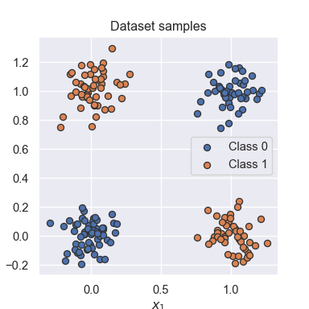
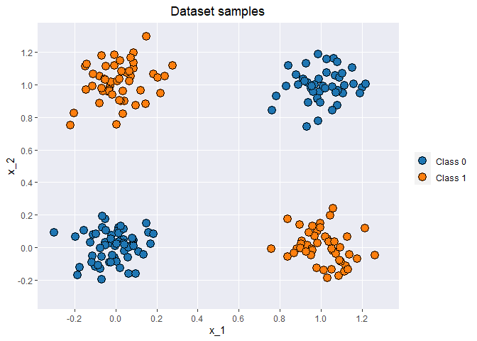
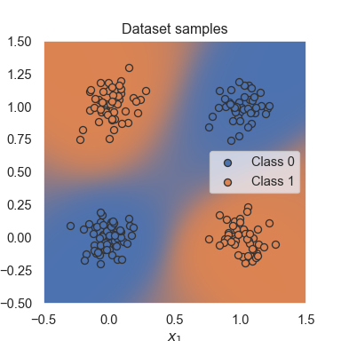
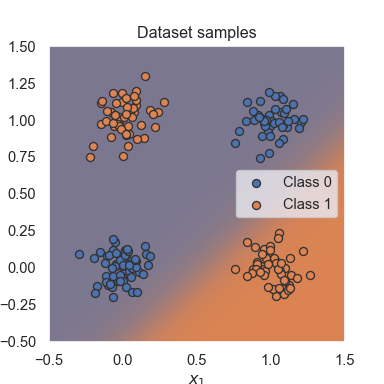
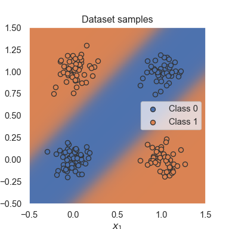

Continuing with UvA’s [Tutorial
2](https://uvadlc-notebooks.readthedocs.io/en/latest/tutorial_notebooks/tutorial2/Introduction_to_PyTorch.html),
covering GPU/CPU support and an example.

``` python
import os
import math
import numpy as np
import time

## Imports for plotting
import matplotlib.pyplot as plt
from matplotlib.colors import to_rgba
import seaborn as sns
sns.set()

## Progress bar
from tqdm.notebook import tqdm

import torch
print("Using torch", torch.__version__, "with CUDA", torch.cuda_version)
```

    ## Using torch 2.0.1 with CUDA 11.7

# GPU Support

Check that my GPU is setup correctly.

``` python
torch.cuda.is_available()
```

    ## True

By default, torch tensors get stored on the CPU and can be put on the
GPU by defining a device object that points to the GPU, and then pushing
tensors to it via the `.to` or `.cuda` functions.

``` python
device = torch.device("cuda") if torch.cuda.is_available() else torch.device("cpu")

print("Device:", device)  
```

    ## Device: cuda

Now that the device is defined, we can push tensors to it…

``` python
x = torch.zeros(2, 3)
x = x.to(device)
x
```

    ## tensor([[0., 0., 0.],
    ##         [0., 0., 0.]], device='cuda:0')

Easy. \> PyTorch also supports multi-GPU systems, but this you will only
need once you have very big networks to train (if interested, see the
[PyTorch
documentation](https://pytorch.org/docs/stable/distributed.html#distributed-basics)).

We can benchmark the runtime for a large matrix multiplication on the
CPU versus on the GPU.

``` python
x = torch.randn(5000, 5000)

## CPU version
start_time = time.time()
_ = torch.matmul(x, x)
end_time = time.time()
print(f"CPU time: {(end_time - start_time):6.5f}s")
```

    ## CPU time: 0.48866s

``` python
## GPU version
x = x.to(device)
_ = torch.matmul(x, x) # Fires up GPU
# CUDA is asynchronous, so use different timing functions 
start = torch.cuda.Event(enable_timing = True)
end = torch.cuda.Event(enable_timing = True)
start.record()
_ = torch.matmul(x, x)
end.record()
torch.cuda.synchronize() # waits for all to finish running on GPU
print(f"GPU time: {0.001 * start.elapsed_time(end):6.5f}s")
```

    ## GPU time: 0.05958s

My GPU is about 5x faster. The difference in the tutorial was much more
dramatic (orders of magnitude):

> CPU time: 0.20694s  
> GPU time: 0.00985s

I might not have the right GPU setup. I’ll check my device properties…

``` python
print("Number of GPUs:", torch.cuda.device_count())
```

    ## Number of GPUs: 1

``` python
print("Device details:\n",torch.cuda.get_device_properties(device))
```

    ## Device details:
    ##  _CudaDeviceProperties(name='NVIDIA GeForce GTX 1660 Ti', major=7, minor=5, total_memory=6143MB, multi_processor_count=24)

Only 1 is available, and it looks like the correct one. I also ran
`nvidia-smi` in a windows cmd prompt and saw this same (and only this
one) GPU there. I guess the GPU used in the tutorial was just super
powerful in comparison with mine!

The tutorial notes that when generating random numbers, we can manually
set the seed on the GPU and specify `cudnn` to be deterministic so that
code output isn’t different every time we run it on the exact same
hardware.

# Learning by example: Continuous XOR

To conveniently build neural networks in pytorch, we will use the
`{torch.nn}` package. Here’s the default template

``` python
class MyModule(nn.Module):

    def __init__(self):
        super().__init__()
        # Some init for my module

    def forward(self, x):
        # Function for performing the calculation of the module.
        pass
```

We’re going to build a neural network that can learn how to classify two
binary inputs as 1 if either input is 1, or 0 in all other cases. We’ll
also add some gaussian noise on the binary inputs.

## The model

Docs for `{torch.nn}` are
[here](https://pytorch.org/docs/stable/nn.html).

Another useful torch package is `{torch.nn.functional}` which has
functions instead of `nn.Modules` that `torch.nn` will otherwise define.

``` python
import torch.nn as nn
import torch.nn.functional as F
```

*side note:* Aw, sadly, I can’t access the python docs for functions in
RStudio by using the F1 key. Seems to be an issue for certain versions
of `{reticulate}` or something. It [should
work](https://rstudio.github.io/reticulate/articles/rstudio_ide.html)
though.

## nn.Module

Neural networks in pytorch are built up out of modules. The basic
template includes an `init` function where parameters are created using
`nn.Parameter` and a `forward` function for model computations that
determine the prediction. The backward calculation is done
automatically! It can be overwritten if needed.

## Simple classifier

There are pre-defined modules to setup a small neural network. We will
have an input layer, a hidden layer with a tanh  activation function,
and an output layer.

Here’s the first simple classifier.

``` python
class SimpleClassifier(nn.Module):
  
  def __init__(self, num_inputs, num_hidden, num_outputs):
    super().__init__()
    # Initialize the modules we need to build the network
    self.linear1 = nn.Linear(num_inputs, num_hidden)
    self.act_fn = nn.Tanh()
    self.linear2 = nn.Linear(num_hidden, num_outputs)
    
  def forward(self, x):
    # Perform the calculation of the model to determine the prediction
    x = self.linear1(x)
    x = self.act_fn(x)
    x = self.linear2(x)
    return x
```

> Note that we do not apply a sigmoid on the output yet. This is because
> other functions, especially the loss, are more efficient and precise
> to calculate on the original outputs instead of the sigmoid output. We
> will discuss the detailed reason later.

Ok.

``` python
model = SimpleClassifier(
  num_inputs = 2, 
  num_hidden = 4, 
  num_outputs = 1
)

print(model)
```

    ## SimpleClassifier(
    ##   (linear1): Linear(in_features=2, out_features=4, bias=True)
    ##   (act_fn): Tanh()
    ##   (linear2): Linear(in_features=4, out_features=1, bias=True)
    ## )

We can get the parameters of the module out, if needed.

``` python
for name, param in model.named_parameters():
  print(f"Parameter {name}, shape {param.shape}")
```

    ## Parameter linear1.weight, shape torch.Size([4, 2])
    ## Parameter linear1.bias, shape torch.Size([4])
    ## Parameter linear2.weight, shape torch.Size([1, 4])
    ## Parameter linear2.bias, shape torch.Size([1])

Each linear layers’ weight matrix has shape `[output, input]`, and bias
has shape `[output]`.

> Note that parameters are only registered for nn.Module objects that
> are direct object attributes, i.e. self.a = …. If you define a list of
> modules, the parameters of those are not registered for the outer
> module and can cause some issues when you try to optimize your module.
> There are alternatives, like nn.ModuleList, nn.ModuleDict and
> nn.Sequential, that allow you to have different data structures of
> modules. We will use them in a few later tutorials and explain them
> there.

Cool. Now on to create some data for fitting this model.

## The data

We’ll use the `{torch.utils.data}` package to load training and test
data. The two classes we’ll use for handling data in pytorch are
`data.Dataset` and `data.DataLoader`.

``` python
import torch.utils.data as data
```

## The dataset class

We need two functions to define a dataset class in pytorch,
`__getitem__` and `__len__`. Here we go.

``` python
class XORDataset(data.Dataset):
  
  def __init__(self, size, std = 0.1):
    """
    Inputs: 
      size - Number of data points we want to generate
      std - Standard deviation of the noise 
    """
    super().__init__()
    self.size = size
    self.std = std
    self.generate_continuous_xor()
    
  def generate_continuous_xor(self):
      # Elements in the XOR dataset have two variables, x and y, that can be either 0 or 1
      # The label is their XOR combination, i.e. 1 if only x or only y is 1 while the other is 0.
      # If x=y, the label is 0.
      data = torch.randint(
        low = 0, 
        high = 2, 
        size = (self.size, 2), 
        dtype = torch.float32
      )
      label = (data.sum(dim = 1) == 1).to(torch.long)
      # We'll add noise to the data points to make things interesting
      data += self.std * torch.randn(data.shape)
      
      self.data = data
      self.label = label
      
  def __len__(self): 
    # Number of data points we have. 
    return self.size
  
  def __getitem__(self, idx): 
    # Return the idx-th element of the dataset
    # If multiple things to return, return as a tuple
    data_point = self.data[idx]
    data_label = self.label[idx]
    return data_point, data_label
```

Neato. Now let’s use this to create a dataset.

``` python
dataset = XORDataset(size = 200)
print("Size of dataset:", len(dataset))
```

    ## Size of dataset: 200

``` python
print("First element:", dataset[0])
```

    ## First element: (tensor([ 0.1118, -0.0284]), tensor(0))

Nice. So we have a tensor of size \[200,2\] that we can use.

How about some viz of this dataset using `matplotlib`? The tutorial
gives us the following.

``` python
def visualize_samples(data, label):
    if isinstance(data, torch.Tensor):
        data = data.cpu().numpy()
    if isinstance(label, torch.Tensor):
        label = label.cpu().numpy()
    data_0 = data[label == 0]
    data_1 = data[label == 1]

    plt.figure(figsize=(4,4))
    plt.scatter(data_0[:,0], data_0[:,1], edgecolor="#333", label="Class 0")
    plt.scatter(data_1[:,0], data_1[:,1], edgecolor="#333", label="Class 1")
    plt.title("Dataset samples")
    plt.ylabel(r"$x_2$")
    plt.xlabel(r"$x_1$")
    plt.legend()
    
visualize_samples(dataset.data, dataset.label)
plt.show()
```


Looks just like the sample data we envisioned at the beginning of this
example.

While I’m in RStudio, how about reproducing this viz in R using
`{ggplot}`?

``` r
library(ggplot2)
```

Looks like there isn’t a built-in theme to make things match the
matplotlib style. Darn.

<https://matplotlib.org/stable/users/prev_whats_new/dflt_style_changes.html>

``` r
py$dataset$data$numpy() %>% 
  as.data.frame() %>% 
  setNames(c("x_1", "x_2")) %>% 
  bind_cols(label = py$dataset$label$numpy() %>% as.factor) %>% 
  ggplot(aes(x = x_1, y = x_2, fill = label)) + 
  geom_point(pch = 21, size = 4) +
  scale_y_continuous(limits = c(-0.3, 1.3), breaks = seq(-0.2, 1.2, 0.2), minor_breaks = NULL) +
  scale_x_continuous(limits = c(-0.3, 1.3), breaks = seq(-0.2, 1.2, 0.2), minor_breaks = NULL) +
  scale_fill_manual(name = NULL, labels = c("Class 0", "Class 1"), values = c("#1f77b4", "#ff7f0e")) + 
  labs(title = "Dataset samples") + 
  theme(
    plot.title = element_text(hjust = 0.5),
    panel.background = element_rect(fill = "#eaebf3")
  )
```


Beautiful.

## The data loader class.

The `torch.utils.data.DataLoader` class will allow us to do automatic
batching, multi-process data loading, sampling, and
[more](https://pytorch.org/docs/stable/data.html#torch.utils.data.DataLoader).
We won’t need to define our own data loader class (like we hda to for
the dataset class). We can create an object of it by using our dataset
as input. Some common input arguments given by the tutorial:

-   `batch_size`: Number of samples to stack per batch

-   `shuffle`: If True, the data is returned in a random order. This is
    important during training for introducing stochasticity.

-   `num_workers`: Number of subprocesses to use for data loading. The
    default, 0, means that the data will be loaded in the main process
    which can slow down training for datasets where loading a data point
    takes a considerable amount of time (e.g. large images). More
    workers are recommended for those, but can cause issues on Windows
    computers. For tiny datasets as ours, 0 workers are usually faster.

-   `pin_memory`: If True, the data loader will copy Tensors into CUDA
    pinned memory before returning them. This can save some time for
    large data points on GPUs. Usually a good practice to use for a
    training set, but not necessarily for validation and test to save
    memory on the GPU.

-   `drop_last`: If True, the last batch is dropped in case it is
    smaller than the specified batch size. This occurs when the dataset
    size is not a multiple of the batch size. Only potentially helpful
    during training to keep a consistent batch size.

Useful. Here we go with creating a data loader object.

``` python
data_loader = data.DataLoader(
  dataset, 
  batch_size = 8, 
  shuffle = True
)
```

``` python
# next(iter(...)) catches the first batch of the data loader
# If shuffle is True, this will return a different batch every time we run this cell
# For iterating over the whole dataset, we can simple use "for batch in data_loader: ..."
data_inputs, data_labels = next(iter(data_loader))

# The shape of the outputs are [batch_size, d_1,...,d_N] where d_1,...,d_N are the
# dimensions of the data point returned from the dataset class
print("Data inputs", data_inputs.shape, "\n", data_inputs)
```

    ## Data inputs torch.Size([8, 2]) 
    ##  tensor([[ 2.5393e-03,  7.5564e-01],
    ##         [-1.1605e-01, -9.3931e-02],
    ##         [-5.2712e-02,  1.7494e-01],
    ##         [ 6.2587e-02,  1.6343e-04],
    ##         [ 2.0619e-01,  1.0436e+00],
    ##         [ 1.0890e+00, -7.9746e-02],
    ##         [ 8.5511e-02,  1.1378e+00],
    ##         [ 3.6891e-02,  1.1293e-01]])

``` python
print("Data labels", data_labels.shape, "\n", data_labels)
```

    ## Data labels torch.Size([8]) 
    ##  tensor([1, 0, 0, 0, 1, 1, 1, 0])

Cool.

# Optimization

We’ve got the model and the dataset, so now we’ll “prepare the
optimization of the model”.

> During training, we will perform the following steps: 1. Get a batch
> from the data loader  
> 2. Obtain the predictions from the model for the batch  
> 3. Calculate the loss based on the difference between predictions and
> labels  
> 4. Backpropagation: calculate the gradients for every parameter with
> respect to the loss  
> 5. Update the parameters of the model in the direction of the
> gradients  

## Loss modules

We will be calculating the loss for a batch by using predefined loss
functions. For binary classification, we can use Binary Cross Entropy
(BCE) which is defined as

ℒ<sub>*B**C**E*</sub> =  − *Σ*<sub>*i*</sub>\[*y*<sub>*i*</sub>log(*x*<sub>*i*</sub>)+(1−*y*<sub>*i*</sub>)log(1−*x*<sub>*i*</sub>)\]

where *y* are the labels and *x* are predictions. Both between \[0,1\].

The full list of 20+ predefined loss functions pytorch has available is
[here](https://pytorch.org/docs/stable/nn.html#loss-functions). There
are two available for BCE,
`[nn.BCELoss](https://pytorch.org/docs/stable/generated/torch.nn.BCELoss.html#torch.nn.BCELoss)`
which expects the inputs to already be on the \[0,1\] scale, and
`[nn.BCEWithLogitsLoss](https://pytorch.org/docs/stable/generated/torch.nn.BCEWithLogitsLoss.html#torch.nn.BCEWithLogitsLoss)`
which has a sigmoid transformation. The tutorial advises the latter in
our case:

> This version is numerically more stable than using a plain Sigmoid
> followed by a BCE loss because of the logarithms applied in the loss
> function. Hence, it is adviced to use loss functions applied on
> “logits” where possible (remember to not apply a sigmoid on the output
> of the model in this case!).

Makes sense. Let’s use it.

``` python
loss_module = nn.BCEWithLogitsLoss()
```

## Stochastic Gradient Descent

This is the simplest of the optimizers to use. The tutorial explains
that the learning rate is a small constant the gets multiplied with the
gradients, and the product is then subtracted from the parameters.

> A good default value of the learning rate for a small network as ours
> is 0.1.

``` python
# the parameters of the model are the input to the optimizer
optimizer = torch.optim.SGD(model.parameters(), lr = 0.1)
```

> The optimizer provides two useful functions: `optimizer.step()`, and
> `optimizer.zero_grad()`. The step function updates the parameters
> based on the gradients as explained above. The function
> `optimizer.zero_grad()` sets the gradients of all parameters to zero.
> While this function seems less relevant at first, it is a crucial
> pre-step before performing backpropagation.

> If we call the backward function on the loss while the parameter
> gradients are non-zero from the previous batch, the new gradients
> would actually be added to the previous ones instead of overwriting
> them. This is done because a parameter might occur multiple times in a
> computation graph, and we need to sum the gradients in this case
> instead of replacing them. Hence, remember to call
> optimizer.zero_grad() before calculating the gradients of a batch.

Got it. We should have each SGD step starting at zero and that doesn’t
happen by default unless we zero out the gradients from the previous
step.

# Training

We’ve got our loss function, and optimizer, and now we can train our
model. I don’t know why, but we first create a “slightly larger” dataset
with a data loader that also has a larger batch size. Do we just need a
ton of data to get this thing to work or something?

``` python
train_dataset = XORDataset(size = 2500)
train_data_loader = data.DataLoader(train_dataset, batch_size = 128, shuffle = True)
```

We will also push the data and model parameters to the GPU. The tutorial
notes it’s less about performance for the tiny neural network in this
example, and all about the practice.

``` python
# Push model to device. Has to be only done once
model.to(device)
```

    ## SimpleClassifier(
    ##   (linear1): Linear(in_features=2, out_features=4, bias=True)
    ##   (act_fn): Tanh()
    ##   (linear2): Linear(in_features=4, out_features=1, bias=True)
    ## )

And now we’ll train the model.

> There exist certain modules that need to perform a different forward
> step during training than during testing (e.g. BatchNorm and Dropout),
> and we can switch between them using `model.train()` and
> `model.eval()`.

``` python
def train_model(model, optimizer, data_loader, loss_module, num_epochs=100):
    # Set model to train mode
    model.train()

    # Training loop
    for epoch in tqdm(range(num_epochs)):
        for data_inputs, data_labels in data_loader:

            ## Step 1: Move input data to device (only strictly necessary if we use GPU)
            data_inputs = data_inputs.to(device)
            data_labels = data_labels.to(device)

            ## Step 2: Run the model on the input data
            preds = model(data_inputs)
            preds = preds.squeeze(dim=1) # Output is [Batch size, 1], but we want [Batch size]

            ## Step 3: Calculate the loss
            loss = loss_module(preds, data_labels.float())

            ## Step 4: Perform backpropagation
            # Before calculating the gradients, we need to ensure that they are all zero.
            # The gradients would not be overwritten, but actually added to the existing ones.
            optimizer.zero_grad()
            # Perform backpropagation
            loss.backward()

            ## Step 5: Update the parameters
            optimizer.step()
```

Here we go…

``` python
train_model(model, optimizer, train_data_loader, loss_module)
```

    ##   0%|          | 0/100 [00:00<?, ?it/s]

It looks ready, I think? We’ll find out.

## Saving a model

All the learnable parameters from the model can be extractd by using
`state_dict`.

``` python
state_dict = model.state_dict()
print(state_dict)
```

    ## OrderedDict([('linear1.weight', tensor([[-1.2823, -1.6045],
    ##         [ 2.1378, -2.5418],
    ##         [ 2.3116,  2.1348],
    ##         [-2.9721,  2.6486]], device='cuda:0')), ('linear1.bias', tensor([ 2.2569, -1.0068, -0.7683, -1.3263], device='cuda:0')), ('linear2.weight', tensor([[2.6174, 3.4856, 3.2963, 3.8317]], device='cuda:0')), ('linear2.bias', tensor([0.4753], device='cuda:0'))])

Nice, this looks good. We’ll save this so that we can load these same
weights when needed later.

``` python
torch.save(state_dict, "our_model.tar")
```

Then to load it, we’ll use `torch.load`, and the module function
`load_state_dict` to overwrite our parameters with the new values.

``` python
# Load state dict from the disk
state_dict = torch.load("our_model.tar")

# Create a new model and load the state
new_model = SimpleClassifier(
  num_inputs = 2, 
  num_hidden = 4, 
  num_outputs = 1
)
new_model.load_state_dict(state_dict)
```

    ## <All keys matched successfully>

``` python
# Check that the parameters are the same in both
print("Original model\n", model.state_dict())
```

    ## Original model
    ##  OrderedDict([('linear1.weight', tensor([[-1.2823, -1.6045],
    ##         [ 2.1378, -2.5418],
    ##         [ 2.3116,  2.1348],
    ##         [-2.9721,  2.6486]], device='cuda:0')), ('linear1.bias', tensor([ 2.2569, -1.0068, -0.7683, -1.3263], device='cuda:0')), ('linear2.weight', tensor([[2.6174, 3.4856, 3.2963, 3.8317]], device='cuda:0')), ('linear2.bias', tensor([0.4753], device='cuda:0'))])

``` python
print("\nLoaded model\n", new_model.state_dict())
```

    ## 
    ## Loaded model
    ##  OrderedDict([('linear1.weight', tensor([[-1.2823, -1.6045],
    ##         [ 2.1378, -2.5418],
    ##         [ 2.3116,  2.1348],
    ##         [-2.9721,  2.6486]])), ('linear1.bias', tensor([ 2.2569, -1.0068, -0.7683, -1.3263])), ('linear2.weight', tensor([[2.6174, 3.4856, 3.2963, 3.8317]])), ('linear2.bias', tensor([0.4753]))])

Neat. Apparently when we load the state dict we also get back this nice
*All keys matched successfully* message in the console.

# Evaluation

The model is trained, now we can evaluate it on a test set. We’ll create
this test dataset using our XOR dataset class.

``` python
test_dataset = XORDataset(size = 500)

#drop_last means don't drop the last batch although it's smaller than 128
test_data_loader = data.DataLoader(
  test_dataset, 
  batch_size = 128, 
  shuffle = False, 
  drop_last = False
) 
```

And onward to our evaluation function. We’ll use accuracy as our metric,
i.e. # correct / \# predictions.

Since we don’t need to calculate the gradients for evaluation, we can
deactivate this to speed up the model and reduce the required memory by
using `with torch.no_grad():...`.

``` python
def eval_model(model, data_loader):
    model.eval() # Set model to eval mode
    true_preds, num_preds = 0., 0.

    with torch.no_grad(): # Deactivate gradients for the following code
        for data_inputs, data_labels in data_loader:

            # Determine prediction of model on dev set
            data_inputs, data_labels = data_inputs.to(device), data_labels.to(device)
            preds = model(data_inputs)
            preds = preds.squeeze(dim=1)
            preds = torch.sigmoid(preds) # Sigmoid to map predictions between 0 and 1
            pred_labels = (preds >= 0.5).long() # Binarize predictions to 0 and 1

            # Keep records of predictions for the accuracy metric (true_preds=TP+TN, num_preds=TP+TN+FP+FN)
            true_preds += (pred_labels == data_labels).sum()
            num_preds += data_labels.shape[0]

    acc = true_preds / num_preds
    print(f"Accuracy of the model: {100.0*acc:4.2f}%")
```

``` python
eval_model(model, test_data_loader)
```

    ## Accuracy of the model: 100.00%

> If we trained our model correctly, we should see a score close to 100%
> accuracy. However, this is only possible because of our simple task,
> and unfortunately, we usually don’t get such high scores on test sets
> of more complex tasks.

What if we try this again with different batch sizes for the test data?

``` python
test_dataset2 = XORDataset(size = 98*1000)
test_data_loader2 = data.DataLoader(
  test_dataset, 
  batch_size = 89, 
  shuffle = True, 
  drop_last = False
) 

eval_model(model, test_data_loader2)
```

    ## Accuracy of the model: 100.00%

I noticed that smaller batch sizes take slightly more time to complete
if we have a larger dataset, but otherwise no change in the accuracy.

# Visualizing classification boundaries

We can see where the model has created decision boundaries by getting
out predictions for every data point in a range of \[-0.5, 1.5\]. Here’s
the code.

``` python
@torch.no_grad() # Decorator, same effect as "with torch.no_grad(): ..." over the whole function.
def visualize_classification(model, data, label):
    if isinstance(data, torch.Tensor):
        data = data.cpu().numpy()
    if isinstance(label, torch.Tensor):
        label = label.cpu().numpy()
    data_0 = data[label == 0]
    data_1 = data[label == 1]

    fig = plt.figure(figsize=(4,4), dpi=500)
    plt.scatter(data_0[:,0], data_0[:,1], edgecolor="#333", label="Class 0")
    plt.scatter(data_1[:,0], data_1[:,1], edgecolor="#333", label="Class 1")
    plt.title("Dataset samples")
    plt.ylabel(r"$x_2$")
    plt.xlabel(r"$x_1$")
    plt.legend()

    # Let's make use of a lot of operations we have learned above
    model.to(device)
    c0 = torch.Tensor(to_rgba("C0")).to(device)
    c1 = torch.Tensor(to_rgba("C1")).to(device)
    x1 = torch.arange(-0.5, 1.5, step=0.01, device=device)
    x2 = torch.arange(-0.5, 1.5, step=0.01, device=device)
    xx1, xx2 = torch.meshgrid(x1, x2, indexing='ij')  # Meshgrid function as in numpy
    model_inputs = torch.stack([xx1, xx2], dim=-1)
    preds = model(model_inputs)
    preds = torch.sigmoid(preds)
    output_image = (1 - preds) * c0[None,None] + preds * c1[None,None]  # Specifying "None" in a dimension creates a new one
    output_image = output_image.cpu().numpy()  # Convert to numpy array. This only works for tensors on CPU, hence first push to CPU
    plt.imshow(output_image, origin='lower', extent=(-0.5, 1.5, -0.5, 1.5))
    plt.grid(False)
    return fig

_ = visualize_classification(model, dataset.data, dataset.label)
plt.show()
```



Oooh, pretty. The blurry areas are where the model has more uncertainty.

# Changing the hidden layers

## One neuron

How about we alter the number of neurons?

``` python
model2 = SimpleClassifier(
  num_inputs = 2, 
  num_hidden = 1, 
  num_outputs = 1
)
# push model to GPU
model2.to(device)

# get new optimizer
optimizer = torch.optim.SGD(model2.parameters(), lr = 0.1)

# train model
train_model(model2, optimizer, train_data_loader, loss_module)

# evaluate
eval_model(model2, test_data_loader)
```


``` python
visualize_classification(model2, dataset.data, dataset.label)
plt.show()
```



## Two neurons

``` python
model2 = SimpleClassifier(
  num_inputs = 2, 
  num_hidden = 2, 
  num_outputs = 1
)
# push model to GPU
model2.to(device)

# get new optimizer
optimizer = torch.optim.SGD(model2.parameters(), lr = 0.1)

# train model
train_model(model2, optimizer, train_data_loader, loss_module)

# evaluate
eval_model(model2, test_data_loader)
```


``` python
visualize_classification(model2, dataset.data, dataset.label)
plt.show()
```


