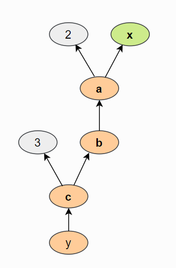

---
output:
  md_document:
    variant: markdown_github
---

Starting with the basics in this notebook based on UvA's [Tutorial 2](https://uvadlc-notebooks.readthedocs.io/en/latest/tutorial_notebooks/tutorial2/Introduction_to_PyTorch.html)

```{r setup, include = FALSE}
library(here)
library(reticulate)
library(dplyr)
```

Here's my python configuration for this project.

```{r}
py_config()
```

I wonder which of the standard Python libraries I have already? Let's check.

```{python}
import os
import math
import numpy as np
import time

## Imports for plotting
import matplotlib.pyplot as plt
from matplotlib.colors import to_rgba
import seaborn as sns
sns.set()

## Progress bar
from tqdm.notebook import tqdm
```

All imported with no issues. Very nice. Thanks, conda. \<3

*8-6-2023 bug encountered with this notebook*\
Every time I tried to run the above chunk to import some python packages, I noticed that `reticulate::repl_python()` would run followed immediately by `exit` and then whatever I had in the setup chunk would be executed. My R Session would then be frozen. Sometimes my session would crash. In other words, I could not run any python chunks. I removed and re-installed {reticulate} and {Rcpp} but this didn't change anything. I unchecked the option to run the setup chunk automatically in my Global Options, and voila - I could then run python chunks. No idea what the issue or bug is related to having the setup chunk prioritized within a python chunk run. Here's my current session info for reference.

```{r}
sessionInfo()
```

# The Basics of PyTorch

Now we'll import torch.

```{python}
import torch
print("Using torch", torch.__version__, "with CUDA", torch.cuda_version)
```

## Tensors

OK, now we'll move on to some `tensor` stuff. In ML/DL context, tensors are basically multidimensional arrays. If you want to go down a rabbit hole about why they're called tensors when tensors are something very specific in mathematics, then you can [start here](https://stats.stackexchange.com/a/198395). 🐇

```{python}
x = torch.Tensor(2, 3, 4)
print(x)
```

Oooh, neat. Apparently memory is allocated when we use `torch.Tensor` but the values it initializes with are those that have already been in memory. I like that (I don't know why, but I do).

Other ways to specify values for tensors:

-   `torch.zeros` - values filled with zeros\
-   `torch.ones` - values filled with ones\
-   `torch.rand` - values filled with samples drawn from a uniform distribution between 0 and 1\
-   `torch.randn` - values filled with samples drawn from a normal distribution with mean 0 and variance 1\
-   `torch.arange` - values are filled with N, N+1, N+2, ..., M. The step can be non-integer, e.g.

```{python}
torch.arange(0, 1, 0.05)
```

We can use nested lists to specify the elements of a tensor directly.

```{python}
x = torch.Tensor([[1, 2], [3, 4]])
print(x)
```

The methods to obtain the shape of a tensor are `size` and `shape`.

```{python}
print("Shape:", x.shape)
print("Size:", x.size())
```

## Tensor to Numpy and vice versa

We use the `from_numpy` to go from a numpy array to a tensor.

```{python}
np_arr = np.array([[1, 2], [3, 4]])
tensor = torch.from_numpy(np_arr)

print(tensor)
```

And `.numpy()` to go from a PyTorch tensor to a numpy array.

```{python}
tensor = torch.arange(4)
np_arr = tensor.numpy()

print("I'm a", tensor)
print("And here I am as an Numpy array: ", np_arr)
```

An important note from the tutorial:

> The conversion of tensors to numpy require the tensor to be on the CPU, and not the GPU (more on GPU support in a later section). In case you have a tensor on GPU, you need to call .cpu() on the tensor beforehand. Hence, you get a line like np_arr = tensor.cpu().numpy().

## Operations

Check the [PyTorch docs](https://pytorch.org/docs/stable/tensors.html#) for the full set of tensor operations available.

We can either create new tensors using operations or use methods to perform in-place operations that will modify the tensor. These usually have an underscore postfix.

```{python}
x1 = torch.rand(2, 3)
x2 = torch.rand(2, 3)
print("x1 before:\n", x1)

# Now add to x1
x1.add_(x2)

print("x1 after:\n", x1)
```

To re-shape tensors we can use `view` and `permute` operations.

View will add on a row and column shape.

```{python}
x = torch.arange(6)
print(x, "\nshapes into")
x.view(2, 3)
```

Permute swaps the dimensions specified.

```{python}
x = x.view(2, 3)
x.permute(0, 1)
```

You have to make sure you permute using the same number of dimensions as the tensor.

Other operations covered in the tutorial are for matrix multiplication.

-   `torch.matmul` - performs matrix product based on the dimensions of the tensors. If both are 2-dim then it will be a standard matrix product. Higher dimensional inputs will use [broadcasting](https://pytorch.org/docs/stable/notes/broadcasting.html#broadcasting-semantics). Can also be written as `a @ b`, which is similar to numpy.

-   `torch.mm` - matrix product over two matrices but doesn't support broadcasting.

-   `torch.bmm` - Performs the matrix product with a support batch dimension. If the first tensor is of shape (b, n, m), and the second tensor (b, m, p), the output is of shape (b, n, p). Basically it uses the first dimension as an index and multiplies the matrices of dimension (n,m) from the first argument by the matrices of dimension (n,p) from the second argument at each index.

-   `torch.einsum` - Performs matrix multiplications and more (i.e. sums of products) using the Einstein summation convention.

Shneat. Some examples to demonstrate the different ways of multiplying stuff.

```{python}
x = torch.arange(6)

x = x.view(2, 3)
print(x)
```

Stacking operations

```{python}
w = torch.arange(12).view(3, 4)
print(w)
```

```{python}
x.matmul(w)
x.mm(w)
```

How about a broadcasting example.

```{python}
x = torch.arange(12).view(2, 3, 2)
w = torch.arange(4).view(1, 2, 2)

z = x.matmul(w)
z.size()
print(z)
```

```{python}
x = torch.arange(8).view(2, 2, 2)
w = torch.arange(12).view(2, 2, 3)

print("x matmul w:\n", x.matmul(w))
print("x bmm w:\n", x.bmm(w))
```

# Indexing

We can index on columns or rows of a tensor by using \\[ similar to as indexing a `data.frame` in R.

```{python}
x = torch.arange(12).view(3, 4)
print("X", x)
```

Speaking of R, what kind of class does R see a PyTorch tensor as?

```{r}
class(py$x)
```

Cool. Within the R chunk we can index for the rows of the tensor, but not any of the columns (any indexing with a comma results in an error for the object).

I'll construct a matrix in R with the same shape and values as the `x` tensor in python.

```{r}
x_as_matrix <- 
  matrix(0:11, nrow = 4, ncol = 3) %>% 
  t()

x_as_matrix
```

Note that indexing in python starts at zero for the first column or row. If you use a `:n` to list multiple indices it only returns up to the `n-1` index.

```{python}
x[0, 0:2] # first row, first two columns
x[0:2, :] # first two rows, all columns
```

To obtain the equivalent parts by indexing the `x` matrix in R we would do.

```{r}
x_as_matrix[1, 1:2]
x_as_matrix[1:2, ]
```

# Dynamic Computation Graph and Backpropagation

Getting gradients and derivatives of functions we define is where its at in PyTorch.

Weight matrices transform an input `x` tensor usually via multiplication and bias vectors usually via addition. A `computational graph` is generated as we stack on transformations to the input. PyTorch will track the manipulations along the way in a `dynamic computation graph`. I wonder if there must be a way to call/view that?

We'll look at an example of how this graph is created for the following function

$$
y =  \frac{1}{x}\Sigma_{i}[(x_i + 2)^2 + 3]
$$

By default tensors created do not require gradients, so this must be specified if needed/desired for the tensor. The input tensor can be thought of as the parameters.

```{python}
x = torch.arange(
  3, 
  dtype = torch.float32, 
  requires_grad = True
)

print(x.requires_grad)
```

To optimize $y$ we'll use its gradients. First we'll build y stepwise.

```{python}
a = x + 2
b = a**2
c = b + 3 
y = c.mean()
print("Y", y)
```
Note how the $y$ has the `grad_fn` defined. 
So the computation graph for $y$ goes backwards from y to x. Here's the figure from the tutorial.



In order to perform backpropagation on the computation graph, we use the `backward()` function on the last output. This will calculate the gradients for each tensor that has the `requires_grad=True` property.

```{python}
y.backward()
```

Executing the above means that now `x.grad` exists. 

```{python}
x.grad
```

These are the gradients of $x$. 