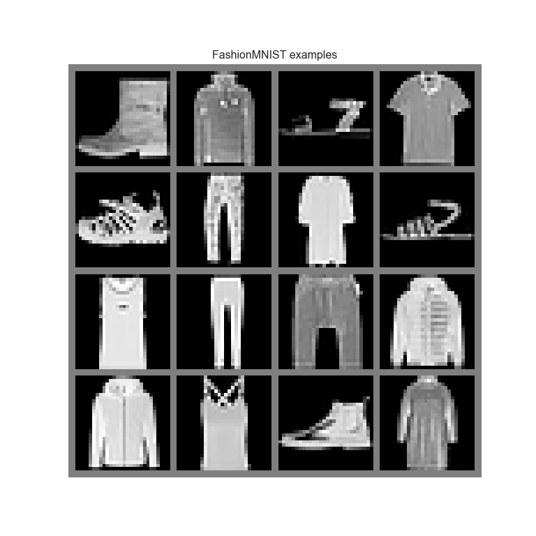
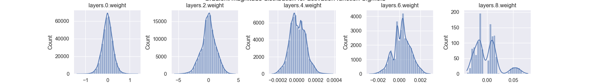
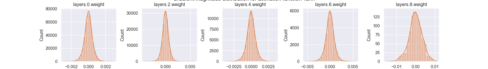
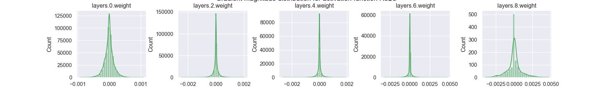
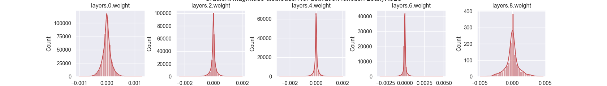
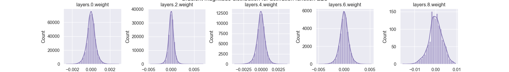
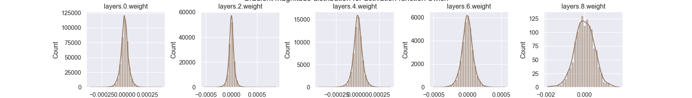

# Analysing the effect of activation functions

Continuing with UvA’s [Tutorial
3](https://uvadlc-notebooks.readthedocs.io/en/latest/tutorial_notebooks/tutorial3/Activation_Functions.html#Analysing-the-effect-of-activation-functions)
on Analysing the effect of AFs.

``` python
## Standard libraries
import os
import json
import math
import numpy as np

## Imports for plotting
import matplotlib.pyplot as plt
import matplotlib_inline as inline
inline.backend_inline.set_matplotlib_formats('svg', 'pdf') # For export
import seaborn as sns
sns.set()

## Progress bar
from tqdm.notebook import tqdm

## PyTorch
import torch
import torch.nn as nn
import torch.nn.functional as F
import torch.utils.data as data
import torch.optim as optim

MAIN_PATH = "C:/stats/uva-dl-tutorials/"
# Path to the folder where the datasets are/should be downloaded (e.g. MNIST)
DATASET_PATH = os.path.join(MAIN_PATH, r'data')
# Path to the folder where the pretrained models are saved
CHECKPOINT_PATH = os.path.join(MAIN_PATH, r'saved_models/tut3')

# Function for setting the seed
def set_seed(seed):
    np.random.seed(seed)
    torch.manual_seed(seed)
    if torch.cuda.is_available(): # GPU operation have separate seed
        torch.cuda.manual_seed(seed)
        torch.cuda.manual_seed_all(seed)
set_seed(42)

# Additionally, some operations on a GPU are implemented stochastic for efficiency
# We want to ensure that all operations are deterministic on GPU (if used) for reproducibility
torch.backends.cudnn.deterministic = True
torch.backends.cudnn.benchmark = False

# Fetching the device that will be used throughout this notebook
device = torch.device("cpu") if not torch.cuda.is_available() else torch.device("cuda:0")
print("Using device", device)
```

    ## Using device cuda:0

``` python
# Base class that all modules inherit
class ActivationFunction(nn.Module):
  
  def __init__(self):
    super().__init__()
    self.name = self.__class__.__name__
    self.config = {"name": self.name}

##############################
class Sigmoid(ActivationFunction):
  
  def forward(self, x):
    return 1 / (1 + torch.exp(-x))
  
##############################
class Tanh(ActivationFunction): 
  
  def forward(self, x):
    x_exp, neg_x_exp = torch.exp(x), torch.exp(-x)
    return (x_exp - neg_x_exp) / (x_exp + neg_x_exp)

##############################
class ReLU(ActivationFunction):

    def forward(self, x):
        return x * (x > 0).float()

##############################
class LeakyReLU(ActivationFunction):

    def __init__(self, alpha=0.1):
        super().__init__()
        self.config["alpha"] = alpha

    def forward(self, x):
        return torch.where(x > 0, x, self.config["alpha"] * x)

##############################
class ELU(ActivationFunction):

    def forward(self, x):
        return torch.where(x > 0, x, torch.exp(x)-1)

##############################
class Swish(ActivationFunction):

    def forward(self, x):
        return x * torch.sigmoid(x)

##############################

act_fn_by_name = {
    "sigmoid": Sigmoid,
    "tanh": Tanh,
    "relu": ReLU,
    "leakyrelu": LeakyReLU,
    "elu": ELU,
    "swish": Swish
}
```

We will use a simple neural network training on
*[FashionMNIST](https://github.com/zalandoresearch/fashion-mnist)* to
see the effect of activation functions.

## Setup neural network

This network will view images as 1D tensors and push them through a
sequence of linear layers and specified activation function.

784 pixels, 10 classifications, 1 input + 4 linear layers

``` python
class BaseNetwork(nn.Module):
  
  def __init__(self, act_fn, input_size = 784, num_classes = 10, hidden_sizes = [512, 256, 256, 128]): 
    """
    Inputs: 
      act_fn - Object of the activation function that should be used as non-linearity in the network. 
      input_size - Size of the input imagines in pixels
      num_classes - Number of classes we want to predict
      hidden_sizes - A list of integers specifying the hidden layer sizes in the NN
    """
    super().__init__()
    
    # Create the network based on the specified hidden sizes
    layers = []
    layer_sizes = [input_size] + hidden_sizes
    for layer_index in range(1, len(layer_sizes)):
      layers += [nn.Linear(layer_sizes[layer_index - 1], layer_sizes[layer_index]),
                 act_fn]
    layers += [nn.Linear(layer_sizes[-1], num_classes)]
    self.layers = nn.Sequential(*layers) # nn.Sequential summarizes a list of modules into a single module, applying them in sequence
    
    # We store all hyperparameters in a dictionary for saving and loading of the model
    self.config = {"act_fn": act_fn.config, "input_size": input_size, "num_classes": num_classes, "hidden_sizes": hidden_sizes}
    
  def forward(self, x):
    x = x.view(x.size(0), -1) # Reshape images to a flat vector
    out = self.layers(x)
    return out
```

> We also add functions for loading and saving the model. The
> hyperparameters are stored in a configuration file (simple json file):

``` python
def _get_config_file(model_path, model_name):
    # Name of the file for storing hyperparameter details
    return os.path.join(model_path, model_name + ".config")

def _get_model_file(model_path, model_name):
    # Name of the file for storing network parameters
    return os.path.join(model_path, model_name + ".tar")

def load_model(model_path, model_name, net=None):
    """
    Loads a saved model from disk.

    Inputs:
        model_path - Path of the checkpoint directory
        model_name - Name of the model (str)
        net - (Optional) If given, the state dict is loaded into this model. Otherwise, a new model is created.
    """
    config_file, model_file = _get_config_file(model_path, model_name), _get_model_file(model_path, model_name)
    assert os.path.isfile(config_file), f"Could not find the config file \"{config_file}\". Are you sure this is the correct path and you have your model config stored here?"
    assert os.path.isfile(model_file), f"Could not find the model file \"{model_file}\". Are you sure this is the correct path and you have your model stored here?"
    with open(config_file, "r") as f:
        config_dict = json.load(f)
    if net is None:
        act_fn_name = config_dict["act_fn"].pop("name").lower()
        act_fn = act_fn_by_name[act_fn_name](**config_dict.pop("act_fn"))
        net = BaseNetwork(act_fn=act_fn, **config_dict)
    net.load_state_dict(torch.load(model_file, map_location=device))
    return net

def save_model(model, model_path, model_name):
    """
    Given a model, we save the state_dict and hyperparameters.

    Inputs:
        model - Network object to save parameters from
        model_path - Path of the checkpoint directory
        model_name - Name of the model (str)
    """
    config_dict = model.config
    os.makedirs(model_path, exist_ok=True)
    config_file, model_file = _get_config_file(model_path, model_name), _get_model_file(model_path, model_name)
    with open(config_file, "w") as f:
        json.dump(config_dict, f)
    torch.save(model.state_dict(), model_file)
```

# Loading FashionMNIST

> FashionMNIST is a more complex version of MNIST and contains
> black-and-white images of clothes instead of digits. The 10 classes
> include trousers, coats, shoes, bags and more.

We’ll make use of the `torchvision` package to load the dataset.

``` python
import torchvision
from torchvision.datasets import FashionMNIST
from torchvision import transforms

# Transformations applied on each image => first make them a tensor, then normalize them in the range -1 to 1
transform = transforms.Compose([transforms.ToTensor(),
                                transforms.Normalize((0.5,), (0.5,))])

# Loading the training dataset. We need to split it into a training and validation part
train_dataset = FashionMNIST(root=DATASET_PATH, train=True, transform=transform, download=True)
train_set, val_set = torch.utils.data.random_split(train_dataset, [50000, 10000])

# Loading the test set
test_set = FashionMNIST(root=DATASET_PATH, train=False, transform=transform, download=True)

# We define a set of data loaders that we can use for various purposes later.
# Note that for actually training a model, we will use different data loaders
# with a lower batch size.
train_loader = data.DataLoader(train_set, batch_size=1024, shuffle=True, drop_last=False)
val_loader = data.DataLoader(val_set, batch_size=1024, shuffle=False, drop_last=False)
test_loader = data.DataLoader(test_set, batch_size=1024, shuffle=False, drop_last=False)
```

This looks like it worked! Let’s see if we can visualize some images.

``` python
exmp_imgs = [train_set[i][0] for i in range(16)]
# Organize the images into a grid for nicer visualization
img_grid = torchvision.utils.make_grid(torch.stack(exmp_imgs, dim=0), nrow=4, normalize=True, pad_value=0.5)
img_grid = img_grid.permute(1, 2, 0)

plt.figure(figsize=(8,8))
```

    ## <Figure size 800x800 with 0 Axes>

``` python
plt.title("FashionMNIST examples")
```

    ## Text(0.5, 1.0, 'FashionMNIST examples')

``` python
plt.imshow(img_grid)
```

    ## <matplotlib.image.AxesImage object at 0x000001E4CED19F10>

``` python
plt.axis('off')
```

    ## (-0.5, 121.5, 121.5, -0.5)

``` python
plt.show()
```



``` python
plt.close()
```

Neat. Onward to…

# Visualizing the gradient flow after initialization

We’ll now take a look at how activation functions propagate gradients
through this ‘freshly initialized network’ and measure the gradients for
a batch of 256 images.

First define the function to perform these steps.

``` python
def visualize_gradients(net, color="C0"):
    """
    Inputs:
        net - Object of class BaseNetwork
        color - Color in which we want to visualize the histogram (for easier separation of activation functions)
    """
    net.eval()
    small_loader = data.DataLoader(train_set, batch_size=256, shuffle=False)
    imgs, labels = next(iter(small_loader))
    imgs, labels = imgs.to(device), labels.to(device)

    # Pass one batch through the network, and calculate the gradients for the weights
    net.zero_grad()
    preds = net(imgs)
    loss = F.cross_entropy(preds, labels)
    loss.backward()
    # We limit our visualization to the weight parameters and exclude the bias to reduce the number of plots
    grads = {name: params.grad.data.view(-1).cpu().clone().numpy() for name, params in net.named_parameters() if "weight" in name}
    net.zero_grad()

    ## Plotting
    columns = len(grads)
    fig, ax = plt.subplots(1, columns, figsize=(columns*3.5, 2.5))
    fig_index = 0
    for key in grads:
        key_ax = ax[fig_index%columns]
        sns.histplot(data=grads[key], bins=30, ax=key_ax, color=color, kde=True)
        key_ax.set_title(str(key))
        key_ax.set_xlabel("Grad magnitude")
        fig_index += 1
    fig.suptitle(f"Gradient magnitude distribution for activation function {net.config['act_fn']['name']}", fontsize=14, y=1.05)
    fig.subplots_adjust(wspace=0.45)
    plt.show()
    plt.close()
```

``` python
# Seaborn prints warnings if histogram has small values. We can ignore them for now
import warnings
warnings.filterwarnings('ignore')
## Create a plot for every activation function
for i, act_fn_name in enumerate(act_fn_by_name):
    set_seed(42) # Setting the seed ensures that we have the same weight initialization for each activation function
    act_fn = act_fn_by_name[act_fn_name]()
    net_actfn = BaseNetwork(act_fn=act_fn).to(device)
    visualize_gradients(net_actfn, color=f"C{i}")
```


